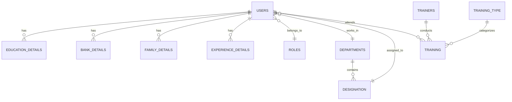

# 🚀 Nexus HRMS - Next-Generation Human Resource Management System

<div align="center">


**A comprehensive, secure, and scalable HRMS solution built with modern Java technologies**

[Features](#features) • [Architecture](#architecture) • [Database](#database) • [Setup](#setup) • [Screenshots](#screenshots)

</div>

---

## 🌟 **Project Overview**

Nexus HRMS is a full-stack Human Resource Management System designed to streamline HR operations from employee onboarding to payroll management. Built with **Java Servlets, JSP, and MySQL**, it features role-based dashboards, real-time analytics, and seamless OAuth2 integration.

### 🎯 **Key Highlights**

- ⚡ **Lightning Fast**: Optimized queries with stored procedures
- 🔐 **Bank-Grade Security**: BCrypt password hashing + OAuth2 authentication
- 📱 **Responsive Design**: Mobile-first AdminLTE interface
- 📊 **Smart Dashboards**: Role-specific analytics with Chart.js
- 🔄 **Real-Time Updates**: AJAX-powered interactions
- 🎨 **Modern UI/UX**: Bootstrap-powered responsive design

---

## 🚀 **Features**

### 👑 **Admin Dashboard**
- **Comprehensive Analytics**: Employee distribution, training metrics, department insights
- **User Management**: Create, modify, and manage employee profiles
- **Training Orchestration**: Assign trainers, schedule sessions, track progress
- **Advanced Reporting**: Export data, generate insights, monitor KPIs

### 👨‍💼 **Employee Self-Service**
- **Personalized Dashboard**: Training progress, upcoming sessions, profile overview
- **Interactive Charts**: Visual representation of training completion rates
- **Profile Management**: Update personal, family, education, and bank details
- **Document Center**: Secure document upload and management

### 🏢 **Organizational Structure**
- **Dynamic Departments**: Flexible department and designation management
- **Reporting Hierarchy**: Clear manager-employee relationships
- **Role-Based Access**: Granular permissions for different user types

### 📚 **Training Management**
- **Internal & External Trainers**: Comprehensive trainer database
- **Training Types**: Categorized learning programs
- **Progress Tracking**: Real-time completion monitoring
- **Cost Management**: Training budget allocation and tracking

### 🏖️ **Leave Management System**
- **Leave Types**: Configurable leave categories
- **Department Policies**: Department-specific leave allocations
- **Approval Workflow**: Multi-level approval process
- **Balance Tracking**: Real-time leave balance updates

### 💰 **Payroll & Compensation**
- **Flexible Salary Structure**: Department and designation-based earning/deduction rules
- **Automated Payslips**: PDF generation with detailed breakdowns
- **Tax Management**: Comprehensive deduction handling
- **Salary History**: Complete compensation tracking

### 📋 **Project & Task Management**
- **Project Lifecycle**: End-to-end project management
- **Task Assignment**: Team collaboration and task tracking
- **Progress Monitoring**: Visual task boards and completion metrics
- **Client Management**: Project-client relationship tracking

### 🎫 **Support Ticketing**
- **Issue Tracking**: Comprehensive ticket management system
- **Assignment Logic**: Automatic ticket routing
- **Resolution Tracking**: Complete issue lifecycle management
- **Communication History**: Threaded conversations

### ⏰ **Attendance & Time Management**
- **Digital Check-in/out**: Time tracking with break management
- **Automated Calculations**: Working hours, overtime, and late penalties
- **Timesheet Approval**: Manager approval workflows
- **Attendance Analytics**: Detailed reporting and insights

---

## 🏗️ **Architecture**

### **Tech Stack**
```
Frontend:  JSP + Bootstrap 5 + AdminLTE + Chart.js
Backend:   Java Servlets + JSTL
Database:  MySQL 8.0+
Security:  BCrypt + OAuth2 (Google Sign-in)
Server:    Apache Tomcat 10.x
Build:     Maven/Gradle (Dynamic Web Project)
```

### **Design Patterns**
- **MVC Architecture**: Clean separation of concerns
- **DAO Pattern**: Database abstraction layer
- **Service Layer**: Business logic encapsulation
- **Filter Pattern**: Authentication and authorization
- **Repository Pattern**: Data access abstraction

### **Project Structure**
```
src/
├── controller/           # Servlets (MVC Controllers)
│   ├── auth/            # Authentication servlets
│   ├── dashboard/       # Dashboard controllers
│   └── employeeController/
├── dao/                 # Data Access Objects
│   ├── dashboard/       # Dashboard DAOs
│   └── employee/        # Employee-related DAOs
├── service/             # Business Logic Layer
│   ├── dashboard/       # Dashboard services
│   └── employee/        # Employee services
├── helper/              # Helper classes and DTOs
│   ├── dashboardHelper/ # Dashboard models
│   └── employeeHelper/  # Employee models
├── util/                # Utilities (DB, Email, etc.)
└── filter/              # Authentication filters

webapp/
├── pages/               # JSP pages
├── dist/                # AdminLTE assets
├── plugins/             # Third-party plugins
└── images/              # Static resources
```

---

## 💾 **Database Schema**

### **Core Entity Relationship**



### **Database Creation**
```sql
CREATE DATABASE nexus_hrms_db;
USE nexus_hrms_db;
```

### **🗂️ Core Tables Overview**

#### **🔐 Authentication & Authorization**
- **`roles`**: System roles (Admin, Manager, Employee)
- **`users`**: Employee master data with authentication

#### **🏢 Organizational Structure**
- **`departments`**: Company departments
- **`designation`**: Job titles and positions
- **Hierarchical relationships with reporting managers**

#### **👥 Employee Information**
- **`education_details`**: Academic background
- **`bank_details`**: Banking information for payroll
- **`family_details`**: Emergency contacts and dependents
- **`experience_details`**: Previous work experience

#### **📚 Training Ecosystem**
- **`training_type`**: Categories of training programs
- **`trainers`**: Internal and external trainer database
- **`training`**: Training sessions and assignments

#### **🏖️ Leave Management**
- **`master_leaves`**: Leave type definitions
- **`department_wise_leaves`**: Department-specific policies
- **`leave_requests`**: Employee leave applications
- **`leave_balance`**: Current leave balances

#### **📋 Project Management**
- **`projects`**: Project master data
- **`task`**: Project tasks and deliverables
- **`task_board`**: Progress tracking
- **`project_user`** & **`task_member`**: Assignment tables

#### **💰 Payroll System**
- **`earning_type`** & **`deduction_type`**: Salary components
- **`earning`** & **`deduction`**: Rules by department/designation
- **`emp_salary`**: Salary records
- **`payslips`**: Generated payslips
- **`employee_earning`** & **`employee_deduction`**: Detailed breakdowns

#### **🎫 Support & Ticketing**
- **`tickets`**: Issue tracking
- **`ticket_replies`**: Communication threads

#### **⏰ Time & Attendance**
- **`attendance`**: Daily attendance records
- **`time_sheet`**: Detailed time tracking

---

## 🎨 **Dashboard Features**

### **Admin Dashboard**
```javascript
// Real-time metrics
- Total Employees: Dynamic count
- Active Departments: Live statistics  
- Training Progress: Completion rates
- Department Distribution: Interactive charts
```

### **Employee Dashboard** 
```javascript
// Personalized experience
- Welcome message with employee name
- Role, Department, Designation info
- Training progress visualization
- Quick access to personal modules
```

---

## 🔐 **Security Features**

### **Authentication Methods**
1. **Manual Login**: Email + BCrypt hashed passwords
2. **OAuth2 Integration**: Google Sign-in with JWT tokens
3. **Forgot Password**: OTP-based reset via email

### **Authorization**
- **Filter-based Security**: `AuthFilter` for route protection
- **Role-based Access Control**: Different dashboards per role
- **Session Management**: Secure session handling

### **Password Security**
```java
// BCrypt implementation
String hashedPassword = BCrypt.withDefaults().hashToString(12, password.toCharArray());
boolean isValid = BCrypt.checkpw(plainPassword, hashedPassword);
```

---

## 📧 **Email Integration**

### **SMTP Configuration**
```java
// Email service for OTP and notifications
- SMTP Server: Gmail (smtp.gmail.com:587)
- Authentication: App-specific passwords
- Features: Welcome emails, OTP delivery, notifications
```

---

## 🚀 **Setup Instructions**

### **Prerequisites**
- ☕ Java 17+ (OpenJDK or Oracle JDK)
- 🗄️ MySQL 8.0+
- 🌐 Apache Tomcat 10.1+
- 🔧 IDE (Eclipse/IntelliJ IDEA)

### **Step 1: Database Setup**
```sql
-- 1. Create database
CREATE DATABASE nexus_hrms_db;

-- 2. Run the complete SQL script provided
-- 3. Insert seed data (roles, departments, admin user)
```

### **Step 2: Project Configuration**
```java
// 1. Update DatabaseConnection.java
private static final String url = "jdbc:mysql://localhost:3306/nexus_hrms_db";
private static final String username = "your_username";
private static final String password = "your_password";

// 2. Update EmailSender.java
private static final String fromEmail = "your_email@gmail.com";
private static final String password = "your_app_password";
```

### **Step 3: OAuth2 Setup**
1. Create Google Cloud Project
2. Enable Google+ API
3. Create OAuth2 credentials
4. Update client ID in `login.jsp`

### **Step 4: Deployment**
```bash
# 1. Deploy to Tomcat
# 2. Access: http://localhost:8080/nexus-hrms
# 3. Default admin login:
#    Email: md.rocks284@gmail.com
#    Password: [check database for hashed password]
```

---

## 📊 **Key Stored Procedures**

### **GetUserDetailsByEmail**
```sql
-- Fetches comprehensive user information
CALL GetUserDetailsByEmail('employee@company.com');
```

---

## 🎯 **Sample Data**

### **Default Admin User**
```sql
-- Admin credentials (for testing)
Email: md.rocks284@gmail.com
Role: Admin
Department: Administration
Designation: Admin Head
```

---

## 🔮 **Future Enhancements**

### **Planned Features**
- 📱 **Mobile App**: React Native companion app
- 🤖 **AI Integration**: Chatbot for HR queries
- 📈 **Advanced Analytics**: Machine learning insights
- 🔔 **Real-time Notifications**: WebSocket implementation
- 🌐 **Multi-tenant**: Support for multiple organizations
- 📋 **Performance Reviews**: 360-degree feedback system
- 🎓 **Learning Management**: Integrated LMS platform

### **Technical Improvements**
- ⚡ **Spring Boot Migration**: Modern framework adoption
- 🐳 **Containerization**: Docker deployment
- ☁️ **Cloud Ready**: AWS/Azure deployment
- 🔄 **API Development**: RESTful service layer
- 📝 **Documentation**: Swagger/OpenAPI integration

---

## 🤝 **Contributing**

We welcome contributions! Please follow these steps:

1. 🍴 Fork the repository
2. 🌿 Create a feature branch (`git checkout -b feature/AmazingFeature`)
3. 💻 Make your changes
4. ✅ Test thoroughly
5. 📝 Commit changes (`git commit -m 'Add AmazingFeature'`)
6. 📤 Push to branch (`git push origin feature/AmazingFeature`)
7. 🔄 Open a Pull Request

---

## 📄 **License**

This project is licensed under the MIT License - see the [LICENSE](LICENSE) file for details.

---

## 👨‍💻 **Author**

**MD Arbaaz Alam**
- 📧 Email: md.rocks284@gmail.com
- 💼 LinkedIn: [Your LinkedIn Profile]
- 🐱 GitHub: [Your GitHub Profile]

---

## 🙏 **Acknowledgments**

- **AdminLTE**: Beautiful admin dashboard template
- **Bootstrap**: Responsive CSS framework
- **Chart.js**: Interactive charts and graphs
- **MySQL**: Reliable database management
- **Apache Tomcat**: Robust servlet container

---

<div align="center">

**⭐ Star this repository if you found it helpful! ⭐**

**Built with ❤️ using Java & Modern Web Technologies**

</div>
